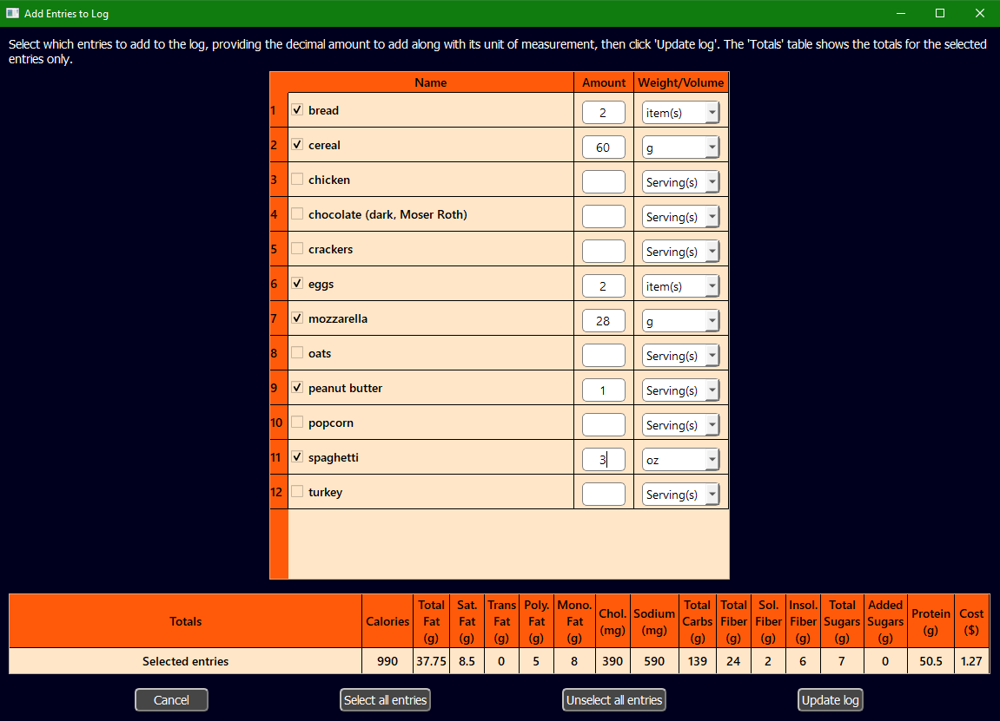

# Health Helper

Health Helper is a small PYQT5 application that allows the user to keep track of the nutritional content of the foods 
they eat, as well as track grocery spending.

# Built With

PYQT5 5.14: Python bindings for Qt

Python 3.8

# Installation

Clone the project.
```bash
git clone https://github.com/Floyd-Droid/HealthHelper.git
```


Use the setup script and pip install.
```bash
pip install .
```

Run the app.
```bash
healthhelper
```

# Interface

Store information about different food items in the Food Dictionary.


You can add cost and nutritional information for each entry.


Once you have added entries to the Food Dictionary, you can choose which entries to add to a log for a specified date.
Simply select the entries to be added and provide an amount for each. The nutrition and cost totals for the selected
items to be added are displayed in a table, so that the user can preview them before committing the entries to the log.



Once entries are added to a log, they are displayed in a table. A separate table displays the totals of all entries, 
as well as totals for the selected entries only.


From here, the log entries can be quickly and easily removed or edited by selecting the desired entries and 
clicking the corresponding buttons.

# Author

Jourdon Floyd

email: jourdonfloyd@gmail.com

GitHub: https://github.com/Floyd-Droid

# License

This project is licensed under the MIT License - see the 
LICENSE.md file for details.
